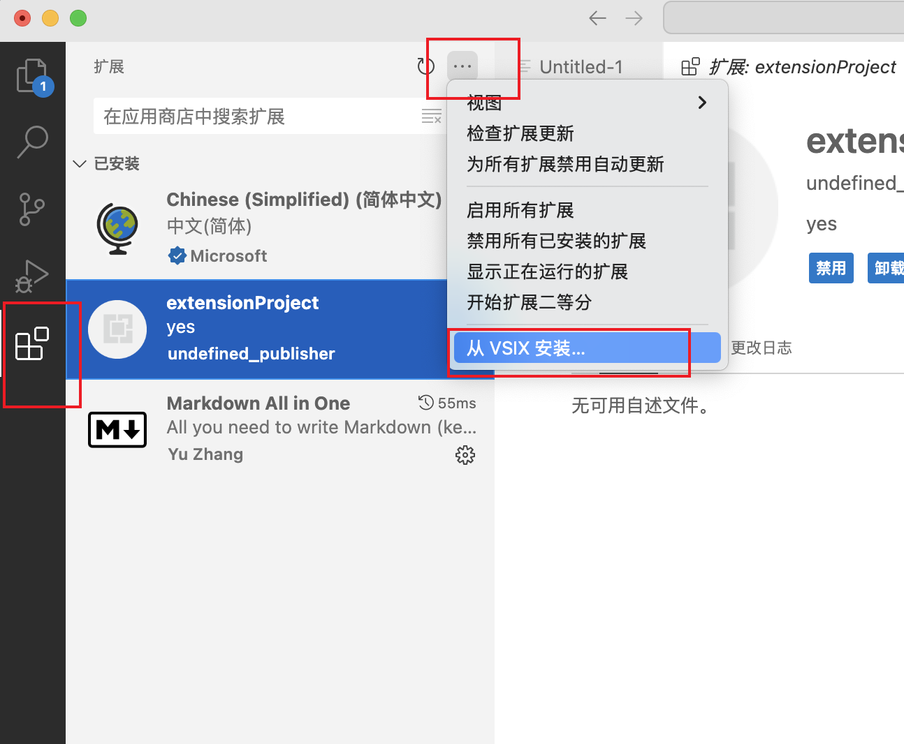
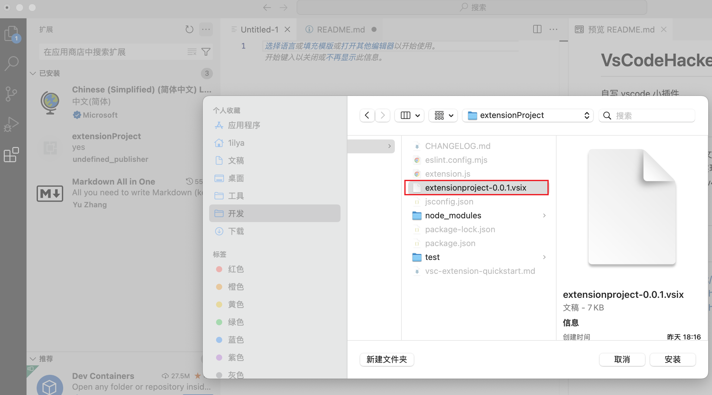
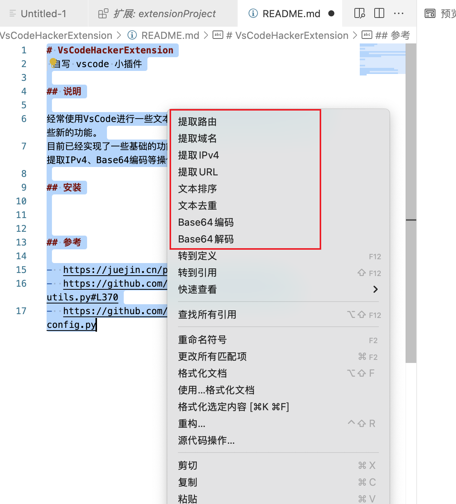

# VsCodeHackerExtension

 因个人喜欢使用 vscode 编辑器所以依据个人平常需求自写了一个文本提取小插件，可以自己二开魔改添加很多其他的功能，如果喜欢用 Sublime Text 编辑器推荐 Xtools 插件，该项目的参考了很多 Xtools 项目的代码。

## 说明

经常使用VsCode进行一些文本过滤去重和关键信息提取操作，后续在加一些新的功能。
目前已经实现了一些基础的功能，例如去重、排序、提取域名、提取路由、提取IPv4、Base64编码等操作（足够个人使用）。

## 安装

## 参考

-  https://juejin.cn/post/7121381959883816968
-  https://github.com/chasingboy/Xtools/blob/main/utils.py#L370
-  https://github.com/chasingboy/Xtools/blob/main/config.py